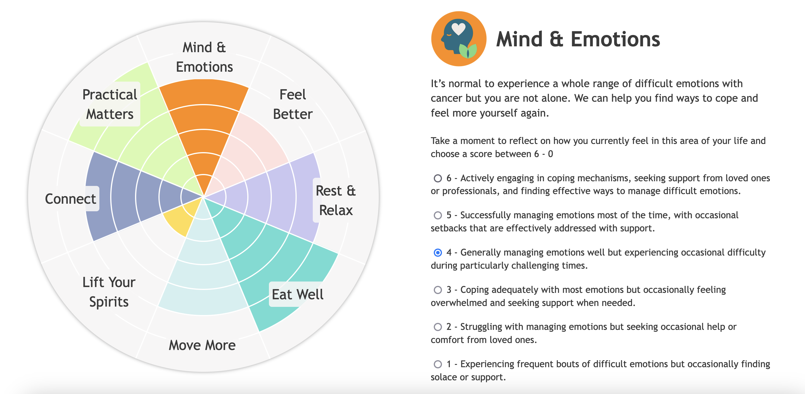

# Penny Brohn

Penny Brohn is a cancer charity based in Pill, Bristol. 

When consulting with clients, one of the tools they use to help signpost them to relevant services they offer is something called the Wellbeing Wheel. This is traditionally on a piece of paper and helps clients to self reflect on different areas of their life and how they currently feel.

I have been working as a volunteer with the charity to help design and build an interactive version of the Wellbeing Wheel that they can host on their WordPress site.

This is the original paper version of the Wheel:

You can view a preview of the interactive version here: https://andyferrie.github.io/pennyBrohn/

